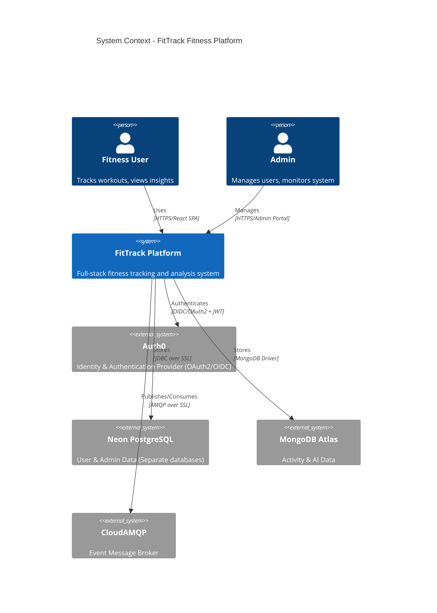
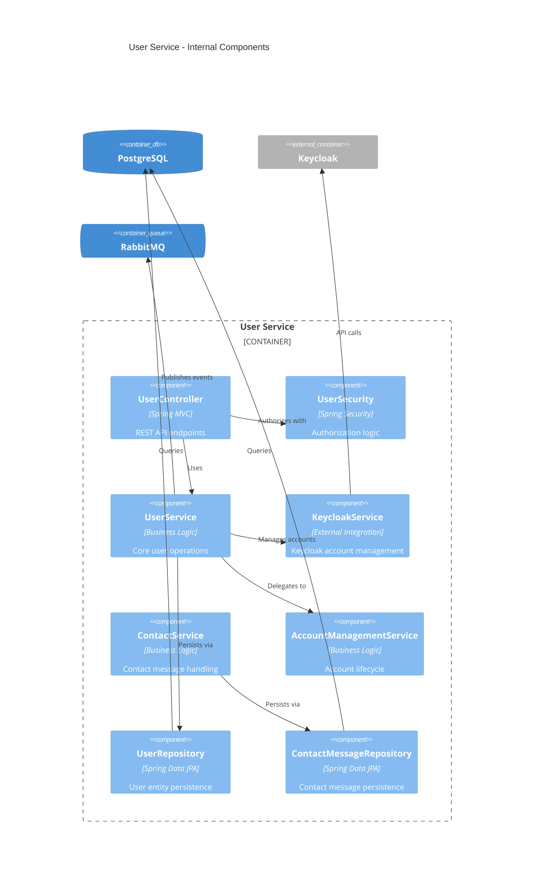
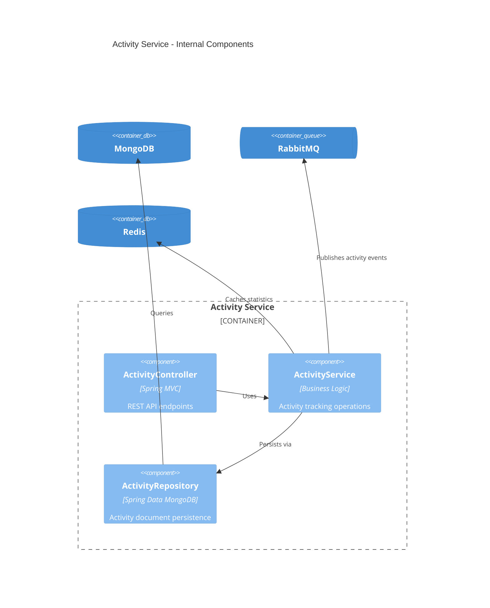
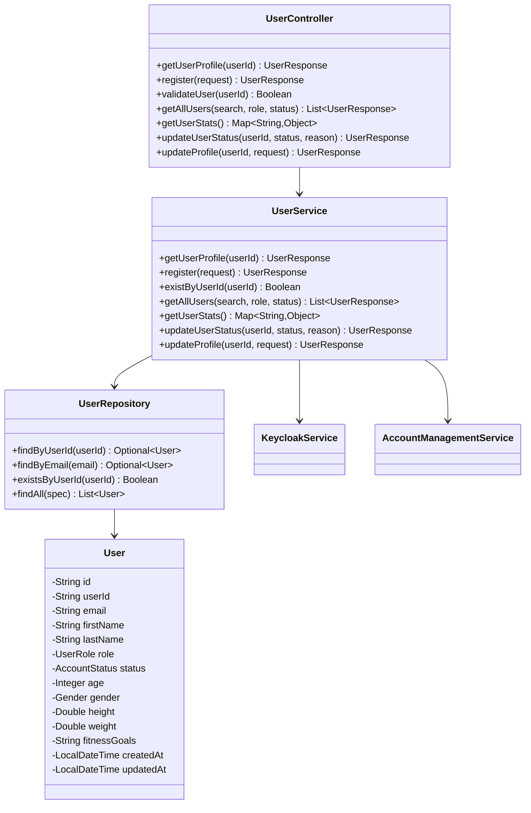
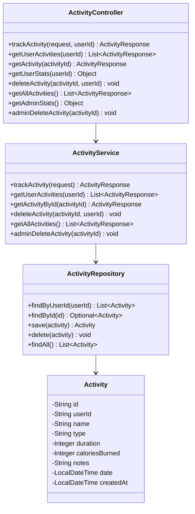
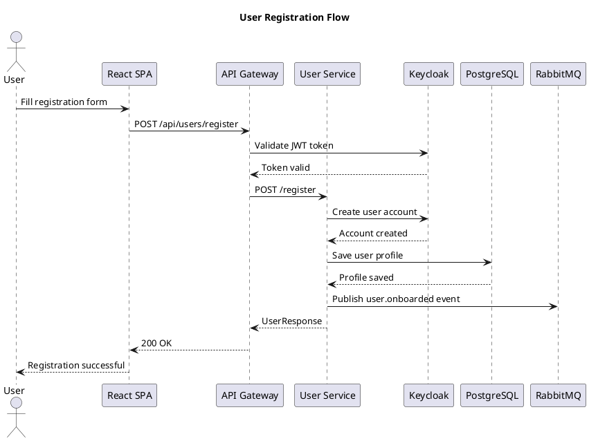
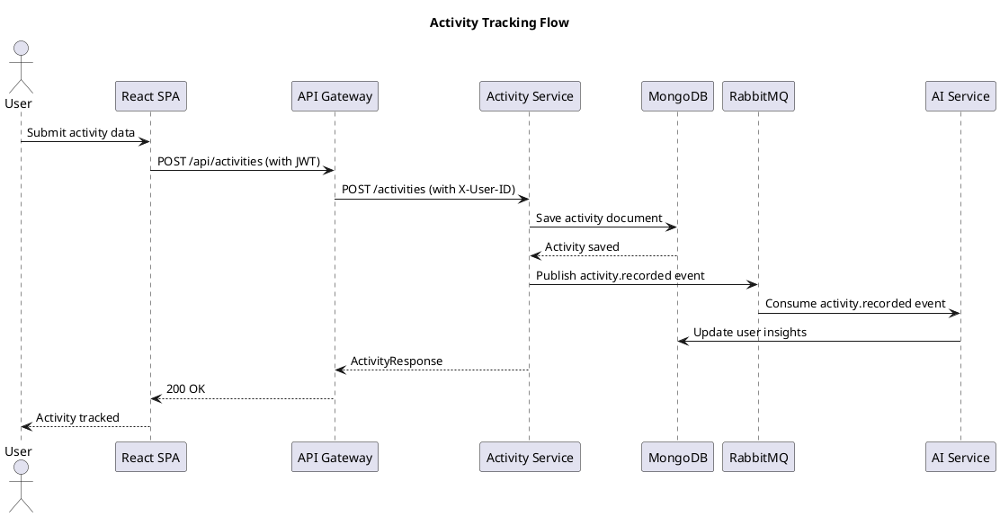

# FitTrack - System Design Documentation

**Last Updated:** January 2026  
**Spring Boot:** 3.5.9 | **Spring Cloud:** 2025.0.0 | **Java:** 21 | **React:** 19 | **Vite:** 7

## Table of Contents
- [C4 Model Architecture](#c4-model-architecture)
  - [Level 1: System Context](#level-1-system-context)
  - [Level 2: Container Diagram](#level-2-container-diagram)
  - [Level 3: Component Diagrams](#level-3-component-diagrams)
  - [Level 4: Code Structure](#level-4-code-structure)
- [PlantUML Diagrams](#plantuml-diagrams)
- [Data Flow Analysis](#data-flow-analysis)
- [Service Interaction Patterns](#service-interaction-patterns)

---

## C4 Model Architecture

### Level 1: System Context



### Level 2: Container Diagram

```mermaid
C4Container
    title Container Diagram - FitTrack Internal Architecture

    Person(user, "User")
    Person(admin, "Admin")
    
    Container_Boundary(c1, "FitTrack Platform") {
        Container(spa, "React SPA", "React 19/Vite 7", "User interface for fitness tracking")
        Container(nginx, "Frontend Server", "Vite Dev/Nginx", "Serves static assets and proxies API")
        Container(gateway, "API Gateway", "Spring Cloud Gateway 4.x", "Entry point, routing, JWT auth")
        
        Container(eureka, "Service Registry", "Eureka Server", "Service discovery")
        Container(config, "Config Server", "Spring Cloud Config", "Centralized configuration")
        
        Container(userservice, "User Service", "Spring Boot", "User management, profiles, onboarding")
        Container(adminservice, "Admin Service", "Spring Boot", "Admin operations, user management")
        Container(activityservice, "Activity Service", "Spring Boot", "Activity tracking, fitness data")
        Container(aiservice, "AI Service", "Spring Boot", "ML insights, recommendations")
    }
    
    ContainerDb(neon, "Neon PostgreSQL", "user_db, admin_db (separate schemas)")
    ContainerDb(mongo, "MongoDB Atlas", "Activities, AI Models")
    ContainerQueue(mq, "CloudAMQP", "Event Messages")
    Container_Ext(auth0, "Auth0", "Identity Provider")
    
    Rel(user, spa, "Uses")
    Rel(admin, spa, "Manages")
    Rel(spa, nginx, "Serves")
    Rel(nginx, gateway, "Proxies API", "/api/*")
    
    Rel(gateway, eureka, "Discovers services")
    Rel(gateway, config, "Gets configuration")
    Rel(gateway, userservice, "Routes /users/*")
    Rel(gateway, adminservice, "Routes /admin/*")
    Rel(gateway, activityservice, "Routes /activities/*")
    Rel(gateway, aiservice, "Routes /ai/*")
    
    Rel(userservice, eureka, "Registers")
    Rel(adminservice, eureka, "Registers")
    Rel(activityservice, eureka, "Registers")
    Rel(aiservice, eureka, "Registers")
    
    Rel(userservice, config, "Gets config")
    Rel(adminservice, config, "Gets config")
    Rel(activityservice, config, "Gets config")
    Rel(aiservice, config, "Gets config")
    
    Rel(userservice, neon, "Stores users (user_db)")
    Rel(adminservice, neon, "Stores admin data (admin_db)")
    Rel(activityservice, mongo, "Stores activities")
    Rel(aiservice, mongo, "Stores AI data")
    
    Rel(userservice, redis, "Cache profiles")
    Rel(activityservice, redis, "Cache stats")
    
    Rel(activityservice, mq, "Publishes activity.recorded")
    Rel(aiservice, mq, "Consumes activity.recorded")
    Rel(userservice, mq, "Publishes user.onboarded")
    
    Rel(gateway, auth0, "Validates JWT")
    Rel(userservice, auth0, "Syncs user metadata")
```

### Level 3: Component Diagrams

#### User Service Components



#### Activity Service Components



### Level 4: Code Structure

#### User Service Class Diagram



#### Activity Service Class Diagram



---

## PlantUML Diagrams

### Sequence Diagram: User Registration Flow



### Sequence Diagram: Activity Tracking Flow



### Component Interaction Diagram

```plantuml
@startuml
title Service Interaction Overview

!include https://raw.githubusercontent.com/plantuml-stdlib/C4-PlantUML/master/C4_Component.puml

Container_Boundary(gateway, "API Gateway") {
    Component(routes, "Route Filters", "Routes & Auth")
}

Container_Boundary(services, "Microservices") {
    Component(user, "User Service", "User Management")
    Component(admin, "Admin Service", "Admin Operations")
    Component(activity, "Activity Service", "Fitness Tracking")
    Component(ai, "AI Service", "ML Insights")
}

Container_Boundary(infra, "Infrastructure") {
    Component(eureka, "Eureka", "Service Discovery")
    Component(config, "Config Server", "Configuration")
    ComponentDb(postgres, "PostgreSQL", "Relational Data")
    ComponentDb(mongo, "MongoDB", "Document Data")
    ComponentDb(redis, "Redis", "Cache")
    ComponentQueue(mq, "RabbitMQ", "Events")
}

Rel(routes, user, "Routes /users/*")
Rel(routes, admin, "Routes /admin/*")
Rel(routes, activity, "Routes /activities/*")
Rel(routes, ai, "Routes /ai/*")

Rel(user, eureka, "Registers")
Rel(admin, eureka, "Registers")
Rel(activity, eureka, "Registers")
Rel(ai, eureka, "Registers")

Rel(user, config, "Gets config")
Rel(admin, config, "Gets config")
Rel(activity, config, "Gets config")
Rel(ai, config, "Gets config")

Rel(user, postgres, "User data")
Rel(admin, postgres, "Admin data")
Rel(activity, mongo, "Activity data")
Rel(ai, mongo, "AI data")

Rel(activity, mq, "Publishes")
Rel(ai, mq, "Consumes")
Rel(user, mq, "Publishes")

Rel(user, redis, "Caches")
Rel(activity, redis, "Caches")
@enduml
```

---

## Data Flow Analysis

### Request Flow Patterns

#### Synchronous Flow (User Profile Request)
1. **Client → Gateway**: JWT validation and routing
2. **Gateway → User Service**: Authorized request with user context
3. **User Service → PostgreSQL**: Query user data
4. **User Service → Redis**: Cache lookup/update
5. **Response Chain**: User data flows back through gateway to client

#### Asynchronous Flow (Activity Analytics)
1. **Activity Service**: Records activity in MongoDB
2. **Activity Service → RabbitMQ**: Publishes `activity.recorded` event
3. **AI Service**: Consumes event asynchronously
4. **AI Service → MongoDB**: Updates user insights and recommendations
5. **Background Processing**: ML models process data without blocking user requests

### Data Storage Patterns

#### PostgreSQL (User Service & Admin Service)
- **User profiles**: Structured relational data with foreign keys
- **Account management**: Status tracking, audit logs
- **Contact messages**: Structured support data

#### MongoDB (Activity Service & AI Service)
- **Activity documents**: Flexible schema for various activity types
- **AI insights**: Complex nested data for recommendations
- **Analytics aggregations**: Pre-computed statistics and trends

#### Redis (Caching Layer)
- **User sessions**: JWT token validation cache
- **Activity statistics**: Pre-computed user metrics
- **Frequently accessed data**: Profile caches, lookup tables

---

## Service Interaction Patterns

### Event-Driven Architecture

#### Published Events
- `user.onboarded`: Triggered after successful user registration
- `activity.recorded`: Triggered after activity tracking
- `user.profile.updated`: Triggered after profile modifications
- `admin.action.performed`: Triggered for audit logging

#### Event Consumers
- **AI Service**: Processes activity events for insights generation
- **Analytics Service**: Aggregates metrics for dashboards
- **Notification Service**: Sends user notifications (future enhancement)

### Security Patterns

#### JWT Flow
1. **Frontend**: Obtains JWT from Keycloak after authentication
2. **Gateway**: Validates JWT signature and extracts user claims
3. **Services**: Receive user context via headers (X-User-ID, X-User-Roles)
4. **Authorization**: Method-level security using Spring Security expressions

#### Service-to-Service Communication
- **Discovery**: Services register with Eureka and discover via service names
- **Configuration**: Centralized config server provides environment-specific settings
- **Health Checks**: Actuator endpoints enable container orchestration health monitoring

### Scalability Considerations

#### Horizontal Scaling
- **Stateless Services**: All business logic services can scale horizontally
- **Database Sharding**: MongoDB supports horizontal partitioning for activity data
- **Cache Distribution**: Redis can be clustered for high availability

#### Performance Optimization
- **Gateway Caching**: Response caching for read-heavy endpoints
- **Database Indexing**: Optimized queries for user and activity lookups
- **Async Processing**: Heavy ML computations offloaded to background workers
